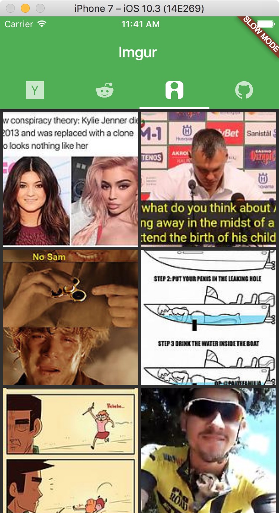

# flews
A news client written in Flutter that displays top stories from Hacker News, Reddit's r/AndroidDev, Imgur's most viral, and GitHub top Java repos.

 
 
 
 

*Design inspired by [CatchUp](https://github.com/hzsweers/CatchUp)*
